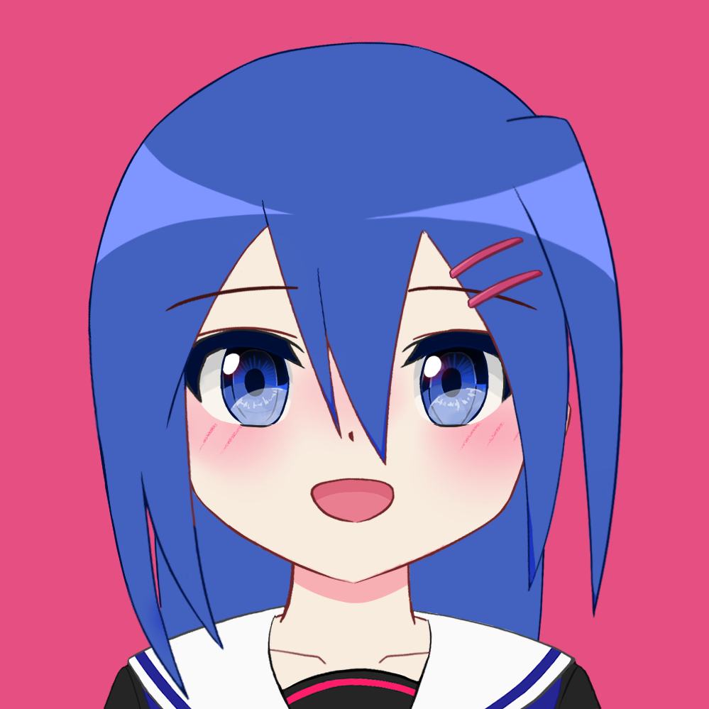

#アイコンの娘をLive2D化しよう01
2022/03/05 - 0:30
***
アイコンの娘は"もの"といいます
*ものちゃん*です

##経緯
以前も一度Live2Dで動かし、ニコニコの公式生放送にZoom参加したことがありました([参照](https://twitter.com/i/status/1386701498113937408 "ツイート - 百花繚乱2021/04/27"))
しかし、当時は時間もなく、*面倒だった*ので、
アイコンの首の角度のままLive2Dにしたのです

あれから1年が経とうとし、アイコンも自己添削を繰り返してどんどん変わっていく中
やはり あの*首が斜めのモデル*が気になり、
新規にLive2Dモデルを作ってみようと思い立ちました

##今回の途中経過
*首*が真っ直ぐになりました(第一関門)
ついでに*目*もパッチリで、*影*もLive2Dのために色々いじりました
もちろん内部的には、"レイヤー順が変わっている"などまだまだ変更点がありますが、
表面に見える範囲では大きくその3か所のみです

以下がオリジナルと加工後です

こうするだけで、ものちゃんの見え方も随分変わりますね
パーツ分けも済んだので、後はLive2Dに読み込んで動きを付ける*だけ*です
いつかは未定ですが、また次回
***
